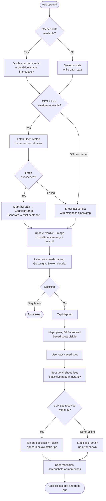
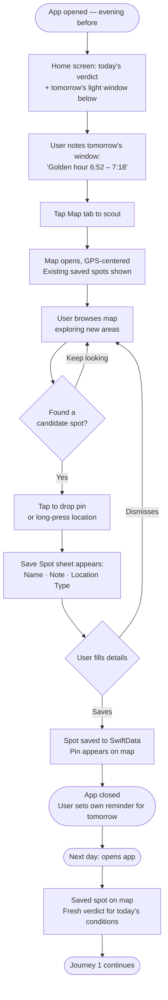
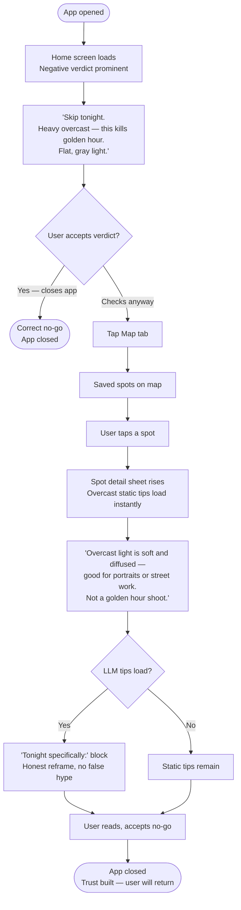

# UX Design Specification — Golden Hour

**Author:** Sarah
**Date:** 2026-05-09

---

<!-- UX design content will be appended sequentially through collaborative workflow steps -->

## Executive Summary

### Project Vision

Golden Hour is a personal iOS utility app that eliminates decision friction around golden hour and blue hour photography outings. It answers four sequential questions — *when are the light windows, is tonight worth going out for, where should I go, and what should I try when I get there* — in under 60 seconds from a single app. This is a personal tool, not a market product: no monetization, no App Store launch, no growth strategy. Success is a Saturday shoot that went better because of it.

The app's defining design philosophy is **opinionated interpretation over raw data**. Weather conditions are translated photographically ("broken clouds — this is the good kind"), not meteorologically. A go/no-go verdict synthesizes everything into a single confident sentence. The LLM tip layer generates specific, contextual guidance for the exact combination of light window × weather × location type — not generic photography advice.

### Target Users

Essentially one person: Sarah. A software engineer and weekend photographer with a mirrorless camera who shoots when the light is right. The defining characteristic is *casual expertise* — enough photographic knowledge to know that cloud cover matters, not enough to intuitively parse a weather app. The frustration is not ignorance; it is friction from tool-switching across multiple apps to make a simple go/no-go call.

**User context:** Saturday evening with ~90 minutes free. Opens the app standing in the kitchen deciding whether to grab the camera bag. Also: Friday evening on the couch scouting for tomorrow. Both workflows matter; the first is primary.

### Key Design Challenges

1. **The verdict must be instantly trustworthy.** The go/no-go sentence must communicate confidence and actionability at a glance — tone and visual hierarchy are doing as much work as the content itself. If it takes reading to parse, it fails.
2. **Two distinct use modes, one app.** Same-evening quick decision (I have 90 minutes, should I go?) vs. night-before planning (scout the map, save a spot, check back tomorrow). These have different paces and different feature priorities; the design must support both without confusion.
3. **Graceful degradation must feel intentional, not broken.** When offline or when LLM tips are unavailable, the app must communicate competently — still useful, not just error-free.
4. **The static → LLM tip transition.** Static tips show instantly; LLM upgrades silently within ~4 seconds. That transition must feel like a natural refinement, not a jarring content replacement.

### Design Opportunities

1. **Opinionated language as a design material.** The honest negative verdict ("Skip tonight — heavy overcast kills golden hour") is a trust-building moment. Confident, non-hedging language throughout is a meaningful differentiator from every weather and photography app that presents data and lets the user decide.
2. **The map as a planning canvas, not navigation.** Night-before scouting is a distinct and enjoyable workflow — the UX can frame this as intentional use rather than a fallback mode.
3. **Simplicity as a feature.** Every pro photography app is overloaded. The constraint of answering exactly four questions for one person is an opportunity to build something unusually focused and satisfying to use.

## Core User Experience

### Defining Experience

The single most important user interaction is **reading the verdict and deciding in under 60 seconds**. This decision takes two forms: same-day action ("grab the bag and go") and advance-planning awareness ("block the calendar, check back at 6pm"). The verdict needs to serve both — it's triggering either action or commitment to check again.

The 5-second first glance is a distinct design challenge from the 60-second decision. Those first seconds are a felt response, not a read. The verdict must feel authoritative before it registers cognitively — that's a typography, color, and hierarchy problem to be solved in visual design. Named here as a first-class design decision.

The ultimate goal of every session: Sarah closes the app and her mind goes somewhere else. She's thinking about her 50mm versus her 24mm, not the interface. The app's job is to hand off to her imagination as quickly as possible.

### Platform Strategy

- **Platform:** iOS only, SwiftUI, portrait-primary, touch-based
- **Location:** GPS-based, automatically centered on open when permission is granted and GPS has resolved. Explicit unavailable states required for: first launch (permission prompt), denied (Settings redirect), and restricted (no recovery). Last known location with staleness indicator is the degraded fallback.
- **Connectivity model:** Light window calculations and saved spots are fully offline. Weather and LLM tips require connectivity. Degraded states present as a smaller version of the app, not a broken one.

### Effortless Interactions

- **Verdict reading** — zero cognitive load, one sentence, felt before it's read
- **Verdict re-opens** — verdict refreshes on each open when weather cache is fresh; shows last verdict with visible timestamp when stale
- **Spot tap → tips** — static tips appear immediately at tap time, always. LLM tips augment (not replace) in a clearly-labeled secondary surface ("Tonight specifically:"), eliminating content-displacement mid-read
- **Spot saving** — one intentional tap from the map; name + optional note + location type. Notes are available as context for LLM tip generation
- **Negative verdict specificity** — no-go verdicts include a falsifiable reason ("patchy cloud cover will kill the light") that Sarah can verify by looking outside. This is what makes a negative verdict trustworthy rather than just disappointing

### Critical Success Moments

1. **First trusted positive verdict** — Sarah goes out, the light is good, the habit forms
2. **First trusted negative verdict** — the verdict says why, Sarah can confirm it with her own eyes, trust deepens
3. **On-location tip moment** — tips reference the actual light window, weather state, and location type; feel like a photographer friend texting, not a generic guide

### Experience Principles

1. **Verdict first, always** — the go/no-go answer lives at the top of every session
2. **Confident, not hedging** — language is opinionated; the app has a point of view
3. **Trust is earned through honesty** — negative verdicts and accurate condition reads are features, not failures
4. **Instant or invisible** — static tips appear at tap; LLM upgrades augment without displacement
5. **Graceful reduction, not degradation** — offline and unavailable states are a smaller version of the app
6. **Get out of the way** — success is Sarah's imagination taking over; the app's job ends at handoff

### Resilience Model

| State | Behavior |
|---|---|
| No network | Last verdict + timestamp shown; spots fully available; tips use static fallback |
| Location denied | Settings redirect with explanation; last known location used if available |
| First launch, no GPS fix | Location prompt; degraded verdict with last known or manual entry fallback |
| Weather cache stale (>3h) | Verdict surface shows last-fetch timestamp; muted staleness label |
| LLM unavailable | Static tips remain; no error state shown |

## Desired Emotional Response

### Primary Emotional Goals

Golden Hour's primary emotional target is **decision confidence** — Sarah should feel certain enough to act, in either direction, without second-guessing. Delight is a side effect of accuracy, not a design goal in itself.

Supporting emotional goals in order:
1. **Anticipation → resolution** — she opens the app hoping for good news; the app resolves that tension immediately and cleanly, in either direction
2. **Preparedness, not anxiety** — when she decides to go, tips should settle her; she should feel like a knowledgeable friend already told her what to try
3. **Trust** — earned over time through honest reads, including negative ones; the app becomes a partner, not a novelty

### Emotional Journey Mapping

| Moment | Desired Feeling | Emotion to Avoid |
|---|---|---|
| Opening the app | Anticipation; quiet hope | Dread of a slow load |
| Reading the verdict | Immediate resolution; confident clarity | Uncertainty from hedged language |
| Positive verdict | A small surge — quickly converted to practical focus | Overwhelm (what do I do now?) |
| Negative verdict | Clean acceptance; no second-guessing | Disappointment, frustration, distrust |
| Tapping a saved spot | Settled, equipped | Anxious about settings |
| On-location, app open | Preparedness; like a friend just texted advice | Feeling like a student reading a manual |
| Closing the app | The app disappears; mind is on the light | Feeling like the app wants more attention |
| Returning after a good session | Quiet satisfaction; want to use it again | — |
| Returning after a miss | No blame; the app was honest | Feeling betrayed or over-promised |

### Micro-Emotions

- **Trust vs. skepticism** — the most critical axis; every other positive emotion depends on this
- **Settled vs. overwhelmed** — the app should never feel like more to process than a quick check
- **Confident acceptance vs. bitter disappointment** — negative verdicts should land cleanly, not leave Sarah feeling like she lost something
- **Preparedness vs. uncertainty** — tips should remove pre-shoot anxiety, not add to it

**Emotions to avoid entirely:**
- Overwhelm from too much information
- Anxiety from hedged or ambiguous verdicts
- Frustration from waiting (loading states on primary content)
- Second-guessing (the verdict should make checking another app feel unnecessary)
- Feeling over-promised (if conditions disappoint after a positive verdict)

### Design Implications

- **Decision confidence** → single declarative verdict sentence; no percentages, no qualifiers
- **Trust** → negative verdicts written with identical care and confidence to positive ones; include a falsifiable reason
- **Preparedness** → specific camera settings (ISO, aperture, shutter speed), not "adjust for available light"
- **Settled focus** → minimal chrome; the verdict surface has nothing competing with it
- **Clean acceptance** → a negative verdict screen feels resolved, not apologetic

### Emotional Design Principles

1. **Resolve tension immediately** — the app's first job on every open is to answer the question Sarah came with
2. **Confidence is the product** — every design decision either builds or erodes certainty; hedging destroys the core value
3. **Honesty over comfort** — a clean "no" builds more trust than an optimistic "maybe"; design negative states with as much care as positive ones
4. **Equip, don't lecture** — tips should feel like a friend's advice, not a photography textbook; specific, direct, human
5. **Earn the right to disappear** — the best session ends with Sarah ignoring the app; design for the handoff, not for engagement

## UX Pattern Analysis & Inspiration

### Inspiring Products Analysis

**Dark Sky** — the gold standard for opinionated, single-verdict utility apps. Key lessons: the headline prediction is the product; everything else is optional detail. Specificity builds trust — a falsifiable claim ("rain in 12 minutes") earns more confidence than a probability distribution. Negative verdicts ("no rain today") receive the same confident treatment as positive ones. The timeline/graph existed below for those who wanted depth, but users who never scrolled had everything they needed.

**Atmospheric weather apps ("Weather Live" style)** — full-bleed background imagery matched to current conditions, with the information layer floating in the foreground. The visual confirms the data emotionally before the user reads a word. Whimsy comes from the imagery itself — the quality and character of the photograph — not from UI chrome or animation. The result is clean, focused, and visually striking without competing with the information.

### Transferable UX Patterns

**Verdict-first information hierarchy (Dark Sky)**
- Single declarative sentence at the top, large, impossible to miss
- Detail available below for those who want it; never required to act
- Applies directly to Golden Hour's home screen: verdict above the fold, condition summary + light window times below

**Visual condition confirmation (atmospheric weather apps)**
- Full-bleed background image matched to photographic condition state
- Image communicates the emotional tone of conditions before text is read
- For Golden Hour: curated condition-specific images (warm broken-cloud golden light, flat gray overcast, deep blue hour twilight) keyed to the `ConditionState` enum
- Foreground: verdict + condition summary + light window times; background: the atmosphere

**Falsifiable specificity (Dark Sky)**
- Predictions that can be verified by looking out the window build trust faster than probabilities
- Applies to Golden Hour's negative verdicts: "patchy cloud cover will flatten the light" is checkable; "conditions may not be ideal" is not

### Anti-Patterns to Avoid

- **Pro suite density (PhotoPills, TPE):** every screen packed with numbers and charts designed for expert use; overwhelming for a quick go/no-go decision
- **Raw meteorological readouts:** cloud cover percentage, dew point, pressure readings — accurate but photographically meaningless without interpretation
- **Hedged language:** "conditions may be favorable" or "there's a chance of good light" — creates exactly the second-guessing the app exists to eliminate
- **Generic stock imagery:** condition backgrounds that look like a weather app, not a photography app; images should feel like frames a photographer would want to take
- **Competing visual elements:** animation, badges, or UI chrome that draws attention away from the verdict

### Design Inspiration Strategy

**Adopt:**
- Dark Sky's verdict-first hierarchy: one sentence, large, at the top, nothing competing with it
- Atmospheric apps' full-bleed condition imagery: visual background confirms verdict emotionally; foreground carries the information

**Adapt:**
- The condition imagery specifically for Golden Hour: not generic weather photos, but photography-condition images — the kind of light that makes a photographer's stomach lift or sink. Six to eight curated images keyed to `ConditionState`
- Dark Sky's confidence register applied to photographic language: same certainty, different domain vocabulary

**Avoid:**
- Any display pattern that requires the user to interpret data rather than read a verdict
- Visual decoration that competes with or slows the reading of the verdict sentence
- Complexity that signals "this is a tool for experts" rather than "this is a tool for one person"

## Design System Foundation

### Design System Choice

**Native iOS (SwiftUI + Apple Human Interface Guidelines) with a custom visual theme layer.**

Golden Hour is an iOS-native app built in SwiftUI. The design system foundation is Apple's own: native components, native interactions, native accessibility behaviors. The visual identity — color, typography, background imagery, and copy register — is applied as a theme on top.

### Rationale for Selection

- **Native behaviors for free:** Dynamic Type scaling, VoiceOver semantics, system sheet and navigation patterns, and haptic feedback all come without custom implementation. These directly support NFR14 (Dynamic Type) and NFR15 (VoiceOver) without additional design work.
- **Solo builder efficiency:** A personal tool built by one person benefits most from not reinventing proven interactions. SwiftUI native components are well-documented, well-tested, and stable.
- **Consistent with inspiration:** Dark Sky and the best atmospheric weather apps achieved visual distinctiveness entirely through theme — not through custom components. The native foundation never shows.
- **Right level of control:** Golden Hour's visual requirements (full-bleed imagery, strong typographic hierarchy, condition-keyed color palette) are all achievable at the theme layer. Nothing requires custom component architecture.

### Implementation Approach

- **Component strategy:** Use SwiftUI's native components (Text, Image, Map, ScrollView, Sheet) as the building blocks. Custom views only where native components can't deliver the required layout — primarily the verdict surface and the condition imagery layer.
- **Navigation:** Minimal tab bar with two destinations (Home, Map) or a simple push/sheet navigation pattern. Decide during screen design; no persistent navigation chrome on the home screen.
- **State-driven visuals:** Background imagery and color accent are driven by the `ConditionState` enum — the same enum that drives verdict language, tip selection, and LLM prompt context.

### Customization Strategy

| Element | Approach |
|---|---|
| Background imagery | 6–8 curated photography-condition images keyed to `ConditionState`; warm golden tones, deep blue hour navy, cool desaturated grays |
| Color palette | Amber/gold (golden hour, positive); deep navy/slate (blue hour); desaturated cool gray (poor conditions); restrained UI chrome so imagery reads clearly |
| Typography | SF Pro or a single clean typeface family; verdict text large and authoritative; condition summary smaller but confident; tips conversational |
| Copy voice | Opinionated, direct, human — established by the LLM prompt and mirrored in all static UI strings |
| Navigation chrome | Minimal; no UI elements competing with the verdict surface on the home screen |

## Core User Experience

### Defining Experience

Golden Hour: **open and know in one glance whether tonight is worth it.**

The defining interaction is not a tap or a swipe — it's a read. Sarah opens the app and within 2–3 seconds, before she's consciously processed the words, the combination of background image and verdict sentence has already answered the question. The atmospheric image lands emotionally; the verdict confirms it cognitively. Together they replace the 10-minute loop of weather app → sunset calculator → domain knowledge → gut call.

If this one moment is designed well — the right visual, the right sentence, the right weight and hierarchy — everything else in the app is supporting detail.

### User Mental Model

**How Sarah currently solves this:**
1. Checks a clock app or Google for today's sunset time
2. Opens a weather app and tries to interpret cloud cover percentage
3. Applies uncertain domain knowledge ("is 40% cloud cover good or bad for golden hour?")
4. Makes a hesitant gut call, often erring toward staying home to avoid a wasted trip

**The mental model she brings:** "I need to check conditions before going out." The frustration is not ignorance — it's that the check requires tool-switching and expertise she doesn't quite have.

**What she expects from Golden Hour:** the answer her expert photographer friend would give if she texted "worth it tonight?" Not a data dump — a read, a reason, and a recommendation.

**Where confusion could arise:**
- If the verdict requires reading more than one sentence to understand, the core experience has failed
- If the background image and verdict text contradict each other emotionally (e.g., a warm golden image with a negative verdict), the dissonance creates doubt
- If the app takes more than 2 seconds to show something meaningful, the moment of anticipation turns to impatience

### Success Criteria

The core interaction succeeds when:
- Sarah reads the verdict and does not feel the need to open another app to double-check
- The verdict communicates *why* (a falsifiable reason), giving Sarah the information to agree or disagree if she chooses
- The visual and text together resolve her question before she finishes reading
- On a positive verdict, her next action is checking the map or grabbing her bag — not reconsidering

The core interaction fails when:
- Sarah closes the app and opens a weather app anyway
- The verdict is ambiguous or hedged enough that she can't act on it
- She can't find the verdict on the screen without searching

### Novel UX Patterns

Golden Hour uses established patterns, executed with unusual commitment to a single point of view.

**Established (adopt directly):**
- Full-bleed atmospheric imagery behind information layer — familiar from weather apps and lock screens
- Single declarative headline at the top — familiar from Dark Sky, notification banners, urgent UI states
- Detail available below the fold — familiar from every progressive-disclosure pattern in consumer apps

**The novel element — photographic interpretation:**
The content of the verdict is new, not the interaction pattern. "40% cloud cover" → "broken clouds — this is the good kind." Raw meteorological data interpreted through a photographic lens, delivered in human voice. Users don't need to learn a new interaction; they need to learn to trust a new kind of answer. That trust is built through accuracy over time, not through onboarding.

**Teaching strategy:** none required for the interaction. The novel layer (opinionated interpretation) reveals itself through use. The first time Sarah reads "broken clouds — this is the good kind" and it's accurate, the trust transfer is complete.

### Experience Mechanics

**1. Initiation**
- App opens directly to home screen; no splash screen, no onboarding for returning users
- GPS coordinates resolve in background; cached location shown immediately if GPS is still acquiring
- Background image is already displayed — keyed to last-known condition state while fresh data loads

**2. Interaction**
- No tap required to read the core answer: verdict sentence, condition summary, and light window times are all visible on the home screen without scrolling
- Verdict reads at a glance: one sentence, large, at the top, on a legible overlay above the condition image
- Optional depth available: scroll down for condition detail, tap the map tab for location scouting

**3. Feedback**
- Visual + text reinforcement: warm golden imagery + confident positive verdict; muted gray imagery + honest negative verdict. The image confirms the verdict emotionally before the text is processed cognitively.
- No loading state for the verdict surface if cached data is available; staleness shown as a muted timestamp, not a spinner
- Condition image swap (when fresh data differs from cached) happens silently if within a defined similarity threshold; visible transition if the condition state changes significantly

**4. Completion**
- Sarah knows whether to go. Two success outcomes: she switches to the map tab to choose a spot, or she closes the app. Both are correct.
- The app doesn't prompt next steps or solicit engagement — it gets out of the way.

## Visual Design Foundation

### Color System

**Source palette:**

| Name | Hex | Character |
|---|---|---|
| Golden | `#DDB05E` | Warm amber — golden hour light |
| Blue | `#92A7D6` | Muted periwinkle — blue hour atmosphere |
| Rose | `#E0C0CB` | Dusty mauve — late-hour twilight glow |
| Lavender | `#E6DAE4` | Pale lavender — soft neutral surface |

**Semantic color mapping:**

| Role | Color | Usage |
|---|---|---|
| Golden hour accent | `#DDB05E` | Positive verdict highlight, golden hour state indicators, active map pins |
| Blue hour accent | `#92A7D6` | Blue hour state, time window labels, map accent |
| UI surface / overlay | `#E6DAE4` at 92% opacity | Bottom sheets, tip cards, condition detail overlays — sits over imagery without competing |
| Secondary surface | `#E0C0CB` | Subtle dividers, secondary labels, soft backgrounds |
| Poor condition state | Desaturated slate `#8A95A8` | Overcast/no-go verdict accent; low-energy, honest |
| Text primary | `#1A1612` (warm near-black) | Body text, labels on light surfaces |
| Text on imagery | `#FFFFFF` / `#F7F3EF` (warm white) | Verdict sentence, condition summary over background photography |
| Text secondary | `#6B6560` (warm gray) | Timestamps, secondary labels, staleness indicators |

**Condition-state color associations (tied to `ConditionState` enum):**

| Condition | Background imagery tone | Accent color |
|---|---|---|
| Broken clouds / golden hour | Warm amber light | `#DDB05E` |
| Clear sky / golden hour | Bright warm gold | `#DDB05E` (lighter) |
| Blue hour (any condition) | Deep navy twilight | `#92A7D6` |
| Overcast | Cool gray, flat light | `#8A95A8` |
| Fog | Soft diffused white-gray | `#E6DAE4` |
| Rain / poor | Dark gray, low contrast | `#8A95A8` |

### Typography System

| Role | Typeface | Size / Weight | Usage |
|---|---|---|---|
| Verdict sentence | New York (Apple serif) | 28–32pt, Regular | The main go/no-go answer; serif adds warmth and authority |
| Condition summary | SF Pro Display | 16pt, Medium | Opinionated condition framing |
| Light window times | SF Pro Display | 14pt, Regular | Golden and blue hour window display |
| Tips body | SF Pro Text | 15pt, Regular | Conversational tip content |
| Camera settings | SF Pro Mono | 13pt, Regular | `ISO 400 · f/8 · 1/60s` — monospace signals technical precision |
| Labels / metadata | SF Pro Text | 12pt, Regular | Timestamps, spot names, staleness indicators |

New York on the verdict: the palette has a film-photography, slightly vintage character. A serif on the single most important sentence adds warmth without fussiness. All other surfaces use system sans-serif for readability and native feel.

All sizes implement Dynamic Type — no fixed pixel sizes. Use SwiftUI semantic font styles mapped to the roles above.

### Spacing & Layout Foundation

**Base unit:** 8pt. All spacing in multiples: 8, 16, 24, 32, 48.

**Home screen:**
- Full-bleed background image, edge to edge
- Verdict surface: bottom-aligned overlay with gradient scrim (`#1A1612` → transparent)
- Verdict sentence: 32pt from scrim top edge
- Verdict → condition summary: 12pt
- Condition summary → light window times: 8pt
- Bottom safe area padding: 24pt above tab bar

**Tip card:**
- Sheet presentation (`.presentationDetents([.medium, .large])`)
- Surface: `#E6DAE4` at 92% opacity, `cornerRadius: 24`
- Inner padding: 24pt horizontal, 20pt vertical
- Static tips → "Tonight specifically:" LLM section: 20pt with `#E0C0CB` divider

**Map screen:**
- MapKit full-bleed
- Spot detail: same card style as tip card
- Active spot pin: `#DDB05E` with subtle drop shadow

### Accessibility Considerations

- **Contrast:** Warm white text over gradient scrim targets WCAG AA (4.5:1) minimum; scrim opacity tuned per condition image during implementation
- **Dynamic Type:** Verdict and condition summary remain single-line through `accessibility2` size; truncate gracefully
- **Color independence:** Condition state communicated by verdict text and background image — color is reinforcement, not sole signal
- **VoiceOver:** Background imagery has descriptive accessibility label ("Golden hour light through broken clouds"); verdict sentence and condition summary are primary VoiceOver focus targets

## Design Direction Decision

### Design Directions Explored

Six directions were generated exploring different approaches to information hierarchy, surface treatment, and atmosphere on the home screen:

1. **Bottom Scrim** — full-bleed image, verdict rising from a gradient scrim at the bottom
2. **Centered Card** — frosted lavender card floating over full-bleed image
3. **Top Verdict** — verdict anchored at the top on a dark header scrim *(selected)*
4. **Split Screen** — top half image, bottom half clean lavender surface
5. **Minimal** — no background photography; palette and type carry the atmosphere
6. **Rising Card** — persistent bottom card over full-bleed imagery

### Chosen Direction

**Direction 03 — Top Verdict**, with a lavender surface tab bar.

The home screen layout:
- Full-bleed condition photography edge to edge
- Dark header scrim (top-anchored gradient: `#1A1612` → transparent) covering approximately the top 50% of the image
- Verdict sentence (New York serif, ~25pt) immediately below the status bar — first element the eye lands on by position
- Condition summary (`#DDB05E`, 12pt, SF Pro, medium weight) below the verdict
- Time pill (rounded label, `rgba(247,243,239,0.14)` background with subtle border) showing the light window range
- Photography fills the remainder of the screen below the header scrim area
- **Tab bar:** lavender surface (`#E6DAE4`), `border-top: 1px solid #E0C0CB` — light and clean, contrasting with the dark atmospheric image above

### Design Rationale

The top-anchored verdict enforces "verdict first, always" through layout position rather than visual weight alone — the eye doesn't need to travel to find the answer. The editorial quality (headline over photograph) fits the app's confident, opinionated voice without feeling like a utility dashboard. The lavender tab bar grounds the bottom of the screen with the palette's warmest neutral, bridging the atmospheric photography above and the map/tips surfaces that share the same surface treatment.

### Implementation Approach

- **Status bar:** light content (white/warm white icons and text) for legibility over the dark header scrim
- **Header scrim:** `LinearGradient` from `rgba(26,22,18,0.88)` at top to `transparent` at ~52% of screen height
- **Verdict text:** rendered above the scrim layer in the SwiftUI view hierarchy; `accessibilityLabel` describes the full verdict
- **Background image:** `Image` view with `.resizable()` and `.scaledToFill()`, clipped to screen bounds; swapped per `ConditionState`
- **Tab bar:** custom SwiftUI tab bar with `#E6DAE4` background; active icon in `#DDB05E`, inactive in `#8A95A8` at reduced opacity

## User Journey Flows

### Journey 1: Same-Day Decision (Primary Success Path)

Sarah has ~90 minutes free. She opens the app to decide whether to go out.

**Tap count to value:** 0 taps to read the verdict. 2 taps to on-location tips (Map tab → spot).

---

### Journey 2: Night-Before Planning

Friday evening. Sarah scouts for tomorrow and saves a spot.

**Key interaction:** the spot note field is surfaced to the LLM tip prompt when the spot is tapped — giving tips a small degree of personalisation over time.

---

### Journey 3: Conditions Say No (Trust-Building Path)

Tuesday evening. Conditions are poor. Sarah opens the app hoping, gets an honest verdict.

**Critical design note:** the negative verdict screen and overcast tip card receive identical visual care to positive states. The image is muted, the language is honest, but the UI is never broken or apologetic.

---

### Journey Patterns

**Navigation patterns:**
- Two-tab structure (Home, Map) — always accessible, no push navigation on the core path
- Spot detail always presented as a bottom sheet (`.presentationDetents([.medium, .large])`), never a full-screen push — preserves map context
- No modal interruptions on the critical path for returning users

**Decision patterns:**
- Verdict → act or close: no intermediate confirmation screens
- Spot tap → sheet rises: zero navigation hierarchy
- Save Spot: one deliberate action from the map; form is minimal (name required, note and type optional)

**Feedback patterns:**
- Static tips: present at tap, zero perceived latency
- LLM tips: augment in a secondary "Tonight specifically:" block — no content displacement, no spinner
- Stale/offline data: muted timestamp label in secondary text, never a modal or blocking alert
- Negative verdict: same confident visual treatment as positive, different image + copy register

### Flow Optimization Principles

1. **Zero taps to the verdict** — the home screen is the answer; no navigation required
2. **Two taps to on-location tips** — Map tab → spot tap; minimum viable path for the on-location use case
3. **No onboarding gates** — returning users never see setup flows or permission prompts unless GPS/location state has changed
4. **Failures are silent or peripheral** — LLM unavailability, stale weather, and GPS delay never block the primary path; they appear as secondary state indicators

## Component Strategy

### Design System Components

Native SwiftUI components used directly, without customisation:

| Component | Usage |
|---|---|
| `Text` | All text rendering — verdict, tips, labels, times |
| `Image` | Condition background photography |
| `Map` (MapKit) | Map screen rendering |
| `ScrollView` | Scrollable tip content in spot detail sheet |
| `.sheet` + `.presentationDetents` | Spot detail sheet presentation |
| `TextField` / `TextEditor` | Spot name and note input in Save Spot sheet |
| `Picker` | Location type selection |
| `Button` | Spot save, map interactions, refresh |
| `Alert` | Spot deletion confirmation |

### Custom Components

**VerdictView**

*Purpose:* The hero of the home screen. Full-bleed condition photography with a dark header scrim, verdict sentence, condition summary, and time pill — all driven by `ConditionState`.

*Anatomy:*
- `ConditionImageView` (background layer, fills screen)
- `LinearGradient` scrim (`#1A1612` → transparent, top-anchored, ~52% height)
- Verdict `Text` (New York serif, ~25pt, warm white) — below status bar
- Condition summary `Text` (`#DDB05E`, 12pt, SF Pro Medium) — 9pt below verdict
- `TimePill` — 8pt below condition summary

*States:*
- **Fresh** — current GPS + current weather, full verdict
- **Stale** — last known data; `StaleDataLabel` visible below time pill
- **Location unavailable** — last known location used; label indicates this
- **Offline** — same as stale; weather and LLM features noted as unavailable

*Accessibility:* `accessibilityElement(children: .combine)` — reads as a single unit: verdict + condition + times. Background image has descriptive `accessibilityLabel` for the condition ("Golden hour light through broken clouds").

---

**ConditionImageView**

*Purpose:* The background photography layer. Displays the curated condition image keyed to the current `ConditionState`. Handles transitions when condition state changes between sessions.

*States:* One image per `ConditionState` value (6–8 images). Transition: crossfade when state changes, no transition on first load.

*Implementation note:* Images bundled in the app; no network fetch. `.resizable()` + `.scaledToFill()` + `.clipped()`.

---

**TimePill**

*Purpose:* Compact display of today's golden hour and blue hour windows in a single line.

*Anatomy:* Rounded rectangle container (`rgba(247,243,239,0.14)` fill, `rgba(247,243,239,0.22)` border, `cornerRadius: 20`) containing a single `Text` line: "6:47 – 7:21 PM · Blue until 7:48"

*Variants:* Standard (on dark scrim, light text) / Light (on lavender surface, dark text).

---

**SpotDetailSheet**

*Purpose:* The bottom sheet that appears when a saved spot is tapped. Contains spot metadata, static tips, and the LLM tip augmentation block.

*Anatomy:*
- Sheet handle (36×4pt, `#E0C0CB`, centered)
- Spot name (`Text`, 18pt, SF Pro Medium)
- Location type badge (small rounded label, `#DDB05E` tint)
- `TipBlock` (static tips)
- `LLMTipBlock` (augmentation, appears when LLM responds)
- Scroll container wrapping all content

*Surface:* `#E6DAE4` at 96% opacity, `cornerRadius: 30` (top corners). `.presentationDetents([.medium, .large])`.

*States:* Standard (static tips shown) / Augmented (LLM block visible below) / Offline (static tips only, no loading indication).

---

**TipBlock**

*Purpose:* Displays the static fallback tip for the current `ConditionState` × light window combination.

*Anatomy:*
- Section label ("For tonight's conditions", 10pt, `#6B6560`, uppercase)
- Tip body `Text` (SF Pro Text, 15pt, conversational)
- Camera settings row: `Text` in SF Pro Mono ("ISO 400 · f/8 · 1/60s"), `#1A1612`, 13pt

*Content guidelines:* Static tips are written for the person already on location — present tense, direct address, specific. Camera settings always present as a starting point.

---

**LLMTipBlock**

*Purpose:* The "Tonight specifically:" augmentation that appears below `TipBlock` when an Anthropic API response arrives within 4 seconds. Augments — never replaces — the static tip.

*Anatomy:*
- `#E0C0CB` divider (1pt) above the block
- Section label ("Tonight specifically", 10pt, `#9B6A2E`, uppercase)
- LLM tip body `Text` (SF Pro Text, 15pt)

*States:* Hidden (LLM not yet responded or timed out) / Visible (LLM response received, opacity transition — no slide or bounce).

*Timing:* If no response within 4 seconds, block remains hidden. No error state, no spinner.

---

**SpotAnnotation**

*Purpose:* Custom map pin for saved spots on the MapKit map.

*Anatomy:* Filled circle (16pt diameter) + subtle drop shadow.

*States:* Unselected (`#8A95A8`, 70% opacity) / Selected (`#DDB05E`, 100% opacity, slight scale-up).

*Accessibility:* `accessibilityLabel` = spot name.

---

**SaveSpotSheet**

*Purpose:* The form that appears when a user saves a new spot from the map.

*Anatomy:*
- Sheet handle + title ("Save Spot")
- `TextField` — spot name (required)
- `TextEditor` — note (optional, 3 lines, placeholder: "e.g. west-facing, try at golden hour")
- `Picker` — location type: Coastal, Urban, Forest, Open Field, Elevated, Other
- Save / Cancel buttons

*Validation:* Name field must be non-empty to enable Save.

---

**StaleDataLabel**

*Purpose:* Muted indicator that shown weather data is from a previous fetch.

*Anatomy:* Single `Text` line ("Weather from 2h ago", 11pt, `#6B6560`, italic). No icon, no warning colour.

*Visibility rule:* Shown when weather cache age exceeds 3 hours or when offline.

---

**CustomTabBar**

*Purpose:* The lavender-surfaced tab bar with two destinations: Home and Map.

*Anatomy:* Fixed-height container (58pt), `#E6DAE4` background, `border-top: 1px solid #E0C0CB`. Active icon: `#DDB05E`; inactive: `#8A95A8` at 50% opacity.

*Note:* Replaces SwiftUI's native `TabView` tab bar to achieve the lavender surface specified in the design direction.

### Component Implementation Strategy

- All custom components are standalone SwiftUI `View` structs — no UIKit bridging unless MapKit requires it
- All components consume `ConditionState` from a shared `@Observable` — single source of truth for condition-driven visuals
- `TipBlock` and `LLMTipBlock` receive content as plain `String` — no formatting logic inside the components
- `SpotDetailSheet` uses `@State` for sheet detent; detent persists across spot selections within a session

### Implementation Roadmap

**Phase 1 — Core path (home screen functional):**
`ConditionImageView` · `VerdictView` · `CustomTabBar` · `TimePill`

**Phase 2 — On-location experience:**
`SpotAnnotation` · `SpotDetailSheet` · `TipBlock` · `LLMTipBlock` · `SaveSpotSheet`

**Phase 3 — Resilience and polish:**
`StaleDataLabel` · Empty states (no saved spots, location unavailable, first launch) · Condition image crossfade transition

## UX Consistency Patterns

### Feedback Patterns

Golden Hour's feedback philosophy: **never interrupt, always inform peripherally.** The primary path is never blocked by a feedback state.

| Situation | Pattern | Visual |
|---|---|---|
| Stale weather data | `StaleDataLabel` below time pill — muted, no icon | "Weather from 2h ago" — `#6B6560`, 11pt italic |
| Offline | Same as stale; tips use static fallback silently | No error banner; no modal |
| LLM timeout | `LLMTipBlock` simply does not appear | No spinner, no error, no message |
| LLM response arrived | `LLMTipBlock` fades in below `TipBlock` | Opacity transition, no content displacement |
| GPS acquiring | Cached location shown while resolving | `StaleDataLabel` variant: "Using last location" |
| Location denied | Dedicated state in `VerdictView` | Inline message with Settings deep-link; not a modal |

**Rule:** No alerts for degraded-but-functional states. Alerts are reserved for irreversible actions only (spot deletion).

### Empty States

| State | Trigger | Message | Action |
|---|---|---|---|
| No saved spots (Map) | Map tab opened, SwiftData has no spots | "No spots saved yet. Tap anywhere on the map to save a location." | Tap opens `SaveSpotSheet` |
| Location unavailable | GPS denied or restricted | "Location unavailable. Golden Hour uses your location for light window calculations." | "Open Settings" deep-link |
| First launch (no data) | Cold launch with no cache | Home screen shows skeleton state until first data arrives | No onboarding modal |
| No network + no cache | Completely fresh install, offline | "No conditions data available. Light window times will appear when connected." | No action required |

**Rule:** Empty states are inline — never modal, never full-screen takeovers.

### Sheet Patterns

All sheets follow a consistent presentation contract:

- **Presentation:** `.sheet` with `.presentationDetents([.medium, .large])`
- **Handle:** 36×4pt `#E0C0CB` pill, centered, 14pt from top edge
- **Surface:** `#E6DAE4` at 96% opacity, `cornerRadius: 30` on top corners
- **Dismissal:** Swipe down or tap outside — no explicit close button
- **Inner padding:** 24pt horizontal, 20pt vertical from handle to content

`SpotDetailSheet` opens at `.medium`; user can pull to `.large` for full tip content.
`SaveSpotSheet` opens at `.medium` only.

### Button Hierarchy

| Level | Style | Usage |
|---|---|---|
| **Primary** | Filled, `#DDB05E` background, `#1A1612` label, `cornerRadius: 12`, 16pt SF Pro Semibold | Save (in `SaveSpotSheet`) |
| **Secondary** | No fill, `#DDB05E` label | Cancel; inline weather refresh |
| **Destructive** | No fill, system red label | Delete Spot — always followed by confirmation `Alert` |

**Rule:** No more than one primary button visible at a time.

### Destructive Action Pattern

Deleting a saved spot is the only destructive action in v1:

1. User accesses "Delete" via long-press on spot annotation or context menu
2. `Alert`: title "Delete [Spot Name]?", message "This can't be undone.", buttons: "Delete" (destructive) / "Cancel" (default)
3. On confirm: spot removed from SwiftData, annotation removed from map, sheet dismissed if open

### Navigation Patterns

- **Tab switching:** instant, native tab bar transition. Home and Map are peers.
- **Sheet presentation:** bottom-up, standard iOS sheet animation. No custom transitions.
- **Sheet dismissal:** swipe down only. No close buttons.
- **Settings deep-link:** used only in the location-unavailable state.

### Copy Voice Patterns

| Context | Register | Example |
|---|---|---|
| Verdict sentence | Confident, declarative, no hedging | "Go tonight. Broken clouds — this is the good kind." |
| Condition summary | Opinionated, one clause | "Broken clouds at golden hour — expect dramatic color." |
| Negative verdict | Honest, not apologetic | "Skip tonight. Heavy overcast flattens everything." |
| Empty state messages | Direct, no sympathy | "No spots saved yet. Tap the map to add one." |
| Stale data label | Factual, minimal | "Weather from 2h ago" |
| Tips (static) | Present tense, direct address | "Shoot toward the water to catch the reflection." |
| Settings/permission | Plain, no urgency | "Golden Hour uses your location for light window calculations." |

**Rule:** No exclamation marks. No "Oops!" error language. No "Please" in form labels.

## Responsive Design & Accessibility

### Responsive Strategy

Golden Hour is iPhone-only, portrait-primary. No tablet, desktop, or landscape requirement in v1. "Responsive" means adapting across iPhone screen sizes — from iPhone SE (375×667pt) to iPhone 16 Pro Max (430×932pt) — and across Dynamic Type size categories.

**Screen size approach:** SwiftUI's native layout system handles the size range automatically when layout is built with relative units and flexible containers. The header scrim height (~52% of screen height) is expressed as a percentage of available height. `VerdictView` content is anchored below the safe area top inset, not at a fixed Y coordinate.

**No landscape support in v1.** Portrait is locked.

**No iPad optimization.** Explicitly out of scope for a personal, non-App-Store tool.

### Dynamic Type Strategy

All text uses SwiftUI's Dynamic Type system. No fixed font sizes in implementation.

| Text role | SwiftUI style mapping | Behaviour at accessibility sizes |
|---|---|---|
| Verdict sentence | `.title` with New York font | Truncates with `lineLimit(2)` at largest sizes |
| Condition summary | `.subheadline` | Single line; truncates if needed |
| Time pill | `.caption` | May wrap to two lines at `accessibility3`+ |
| Tip body | `.body` | Reflows naturally in scroll container |
| Camera settings (mono) | `.caption` with monospaced font | May reflow; acceptable |
| Labels / metadata | `.caption2` | Remains readable through standard accessibility sizes |

**Rule:** Text never clips without truncation. No text rendered smaller than the user's system minimum.

### Accessibility Strategy

Target: **WCAG 2.1 Level AA** as the guiding standard, applied through iOS/SwiftUI equivalents.

**Colour contrast:**
- Warm white text on gradient scrim: target ≥ 4.5:1 — scrim opacity tuned per condition image during development, verified with Xcode Accessibility Inspector
- `#DDB05E` on `#E6DAE4`: ≥ 3:1 for large text; golden accent not used for small body text on light surfaces
- `#1A1612` on `#E6DAE4`: passes 4.5:1 comfortably for all text sizes

**Touch targets:** All interactive elements meet iOS HIG minimum 44×44pt. Spot annotations are 16pt visual size within a 44pt hit area via `.contentShape`.

**VoiceOver:**

| Element | Implementation |
|---|---|
| `VerdictView` | `accessibilityElement(children: .combine)` — reads verdict + condition + times as one unit |
| Background condition image | `accessibilityLabel("Golden hour light through broken clouds")` |
| Camera settings in `TipBlock` | `accessibilityLabel("Starting exposure: ISO 400, f/8, 1/60th of a second")` |
| `LLMTipBlock` appearance | No announcement triggered — content available on next VoiceOver swipe |
| Map spot annotation | `accessibilityLabel` = spot name; `accessibilityHint` = "Double tap to view tips" |
| Custom tab bar items | `.accessibilityLabel("Home")` / `.accessibilityLabel("Map")` |

**Reduce Motion:**
- `LLMTipBlock` opacity transition respects `@Environment(\.accessibilityReduceMotion)` — appears without animation when enabled
- Condition image crossfade disabled when Reduce Motion is on; new image appears instantly

### Testing Strategy

**Device set:**
- iPhone SE 3rd gen (375×667pt) — smallest supported form factor
- iPhone 16 / 16 Pro (390×844pt) — standard modern size
- iPhone 16 Pro Max (430×932pt) — largest form factor

**Dynamic Type:** Test at Default, Large, Accessibility Medium, Accessibility Extra Extra Extra Large. Verify verdict truncates gracefully and tip content reflows without clipping.

**VoiceOver:** Navigate home screen, map tab, spot detail sheet, and save spot form entirely without sight. Verify all interactive elements are reachable and condition images have meaningful labels.

**Colour contrast:** Xcode Accessibility Inspector contrast audit on all six condition image + scrim combinations.

**Reduce Motion:** Verify `LLMTipBlock` appears without fade and condition image transition is instant.

### Implementation Guidelines

- Use `@Environment(\.dynamicTypeSize)` to detect very large sizes and adjust layout constraints (e.g., switch `TimePill` to multi-line at `accessibility3`+)
- Use `@Environment(\.accessibilityReduceMotion)` to conditionally remove opacity/scale animations
- Header scrim height: `.frame(height: proxy.size.height * 0.52)` inside a top-level `GeometryReader` — avoid `GeometryReader` elsewhere
- All `Color` values defined as named assets in the Asset Catalog with light/dark variants — future-proofs the palette even though dark mode is not in v1 scope
- Safe area: condition image uses `.ignoresSafeArea()`; verdict content respects `.safeAreaInset(edge: .top)`
